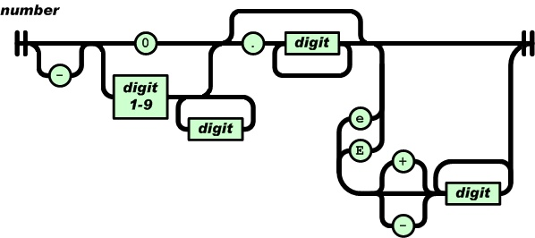

## JSON库

这是一个由C语言编写的 JSON 库，符合标准的 JSON 解析器和生成器。

- `json.h`：头文件，包含相关的函数定义和相关数据结构。
- `json.c`：实现文件，解析器和生成器的实现和相关接口函数的实现。
- `json_unittest.c`： 单元测试文件，包含相关接口函数的测试用例。

### JSON 数据类型

- null：表示为 null
- boolean: 表示为 true 或 false
- number: 数字，用浮点数表示
- string: 字符串，表示为 "..."
- array: 数组，表示为 [...]
- object: 对象，表示为 {...}

对应于 `json.h` 头文件里的 `json_type` 枚举类型：

```c
    typedef enum {
        TYPE_NULL,
        TYPE_FALSE,
        TYPE_TRUE,
        TYPE_NUMBER,
        TYPE_STRING,
        TYPE_ARRAY,
        TYPE_OBJECT
    } json_type;
```

| 枚举值 | 类型 | 
|-|:-|
| TYPE_NULL | null |
| TYPE_FALSE | false |
| TYPE_TRUE | true |
| TYPE_NUMBER | number |
| TYPE_STRING | string |
| TYPE_ARRAY | array |
| TYPE_OBJECT | object |

### JSON 数据结构

对于 JSON 中的每个节点都使用 `json.h` 中 `json_value` 结构体表示：

```c
    struct json_value {
        union {
            struct { json_object* m; size_t size, capacity; }o; /* object */
            struct { json_value* e; size_t size, capacity; }a;  /* array */
            struct { char* s; size_t len; }s;                   /* string: null-terminated string, string length */
            double n;                                           /* number */
        }u;
        json_type type;
    };
```
`json_value` 结构体定义了一个 `type` 字段和 `union` 联合体。

1. `type = TYPE_NULL`，表示值为 null。
2. `type = TYPE_FALSE`，表示值为 false。
3. `type = TYPE_TRUE`，表示值为 true。
4. `type = TYPE_NUMBER`，表示值为数字， `u.n` 表示数字的值。如数字 `"3.1416"` 被解析为：

<div align=center></div>

5. `type = TYPE_STRING`，表示值为字符串， `u.s.s` 表示字符串指针，指向动态内存，`u.s.len` 表示字符串的长度。如字符串 `"abc"` 被解析为：

<div align=center></div>

6. `type = TYPE_ARRAY`，表示值为数组， `u.a.e` 表示数组头部指针，指向动态内存，`u.a.size` 表示数组的大小，`u.a.capacity` 表示数组的容量。如数组 `"["abc",[1,2],3]"` 被解析为：

<div align=center></div>

7. `type = TYPE_OBJECT`，表示值为对象，使用动态对象存放， `u.o.m` 表示动态对象头部指针，指向动态内存，`u.o.size` 表示动态对象的大小，`u.o.capacity` 表示动态对象的容量。对象的结构为：

```c
    struct json_object {
        char *k; size_t klen; /* key string, key string length */
        json_value v;         /* value */
    };
```

如对象 `"{"i":123,"s":"abc","a":[1,2,3],"o":{"1":1,"2":2,"3":3}"` 被解析为：

<div align=center></div>

### JSON 解析器

#### parse 函数 

JSON 文本由3部分组成，首先是空白（whitespace），接着是一个值，最后是空白。

`parse`函数是解析器的总入口函数。`parse`函数首先调用`parse_whitespace`函数跳过前面的空白符，然后调用`parse_value`解析相应的值，最后判断值后面是否只有空白符。

#### parse_value 函数 

parse_value函数根据值的第一个字符判断相应的类型，再调用相应类型的解析函数。

| 字符 | 类型 | 对应的解析函数
|-|:-|:-| 
| n | null | parse_literal |
| f | false | parse_literal |
| t | true | parse_literal |
| " | string | parse_string |
| [ | array | parse_array |
| { | object | parse_object |
| 默认值 | number | parse_number |
| '\0' | 空字符串 | 返回错误码 PARSE_EXPECT_VALUE |

PARSE_EXPECT_VALUE 解析错误对应于`json_unittest.c`文件的单元测试函数：

| 单元测试函数 | 说明 
|-|:-|
| test_parse_expect_value | 测试值是否为空字符串 |

#### false/true/null 解析

调用`parse_literal`函数统一解析，如果值为`null`，则设置`json_value`结构体中的type为`TYPE_NULL`，如果值为`false`，则设置`json_value`结构体中的type为`TYPE_FALSE`，如果值为`true`，则设置`json_value`结构体中的type为`TYPE_TRUE`。

false/true/null 解析对应于`json_unittest.c`文件的单元测试函数：

| 单元测试函数 | 说明 
|-|:-|
| test_parse_null | 测试null值是否解析成功 |
| test_parse_true | 测试true值是否解析成功 |
| test_parse_false | 测试false值是否解析成功 |
| test_parse_invalid_value | 测试值是否有效 |

#### number 解析

JSON 数字是以十进制表示，它主要由4部分顺序组成：负号、整数、小数、指数。只有整数是必需部分。注意和直觉可能不同的是，正号是不合法的。

- 整数部分如果是 0 开始，只能是单个 0；而由 1-9 开始的话，可以加任意数量的数字（0-9）。也就是说，0123 不是一个合法的 JSON 数字。
- 小数部分比较直观，就是小数点后是一或多个数字（0-9）。
- JSON 可使用科学记数法，指数部分由大写 E 或小写 e 开始，然后可有正负号，之后是一或多个数字（0-9）。

如图：



JSON 数字调用`parse_number`函数进行解析，如果解析成功，则调用`strtod`函数转换为浮点数，如果解析出的数字超出范围，则返回`PARSE_NUMBER_TOO_BIG`错误。解析成功后，设置`json_value`的类型为`TYPE_NUMBER`。

number 解析对应于`json_unittest.c`文件的单元测试函数：

| 单元测试函数 | 说明 
|-|:-|
| test_parse_number | 测试number是否解析成功 |
| test_parse_number_too_big | 测试number的值是否超出范围 |
| test_parse_invalid_value |测试值是否有效 |

#### string 解析

JSON 的字符串语法和 C 语言很相似，都是以双引号把字符括起来，如 "Hello"。其中特殊字符需要转义，JSON 共支持 9 种转义序列：

| 转义字符 | 说明 |
|-|:-|
| \\"| 单引号 |
| \\ | 反斜线 |
| / | 正斜线 |
| \b | 退格符 |
| \f | 换页符 |
| \n | 换行符 |
| \r | 回车符 |
| \t | 制表符 |
| \u | 后面跟4个16进位的 UTF-16 编码 |

JSON 字符串调用`parse_string`函数进行解析，`parse_string`函数调用`parse_string_raw`进行解析，如果解析成功，则调用`set_string`函数把动态栈中的字符，拷贝到`json_value`的动态内存中，`json_value`的类型设置为`TYPE_STRING`。

`parse_string_raw`函数对字符串进行解析，如果是普通的字符则直接压如动态栈中，如果是需要转义的字符，则进行相应的转义。对于`\u`转义符后面的4个16进位的 UTF-16 编码，最后统一转换为 UTF-8，关于Unicode编码可以参考[维基百科](https://en.wikipedia.org/wiki/Unicode)。

string 解析对应于`json_unittest.c`文件的单元测试函数：

| 单元测试函数 | 说明 
|-|:-|
| test_parse_string | 测试string是否解析成功 |
| test_parse_invalid_unicode_hex | 测试无效的Unicode数值 |
| test_parse_invalid_unicode_surrogate | 测试无效的Unicode surrogate |
| test_parse_missing_quotation_mark | 测试字符串缺少结束的引号 |
| test_parse_invalid_string_escape | 测试无效的转义符 |
| test_parse_invalid_string_char | 测试无效的字符值 |

#### 动态栈

```c
    typedef struct {
        const char* json;
        char* stack;
        size_t size, top;
    }context;
```

`context`结构中的`json`表示当前输入的要解析的字符串，`stack`表示栈指针，`size`表示栈的大小，`top`表示数据压入时栈的位置。

##### context_push 函数

根据传入的`size`调整栈的大小，当`c->top + size >= c->size`时，则把栈的大小调整为原来的1.5倍，当`c->size == 0`时，使用默认大小，由`PARSE_STACK_INIT_SIZE`指定，返回值当前栈可以压入数据的位置。

##### PUTC 宏

调用`context_push`函数，传入的大小为`sizeof(char)`，根据返回的栈指针，把一个字符压入进栈中。

##### context_pop 函数

根据传入的`size`，栈中弹出`size`元素时，返回的位置，注意此时并不释放内存，栈的内存释放在`json`数据解析完后，在`parse`函数中统一释放。

#### array 解析

JSON 的一个数组可以包含零至多个值，以逗号分隔，例如 []、[1,2,true]、[[1,2],[3,4],"abc"] 都是合法的数组。但注意 JSON 不接受末端额外的逗号，例如 [1,2,] 是不合法的。

JSON 的数组解析使用`parse_array`函数进行解析，`parse_array`函数调用`parse_value`解析数组的每个元素。数组的解析过程是递归下降分析的过程。最终会把每个解析好的元素压入堆栈，解析到数组结束时，再一次性把所有元素弹出，复制至新分配的内存之中。如: `"["abc",[1,2],3]"` 解析为上面的数据结构分析中那张图。

array 解析对应于`json_unittest.c`文件的单元测试函数：

| 单元测试函数 | 说明 
|-|:-|
| test_parse_array | 测试数组是否解析成功 |
| test_parse_invalid_value | 测试值数组是否有效 |

#### object 解析

 JSON 对象由对象成员（member）组成，所谓对象成员，就是键值对，键必须为 JSON 字符串，然后值是任何 JSON 值，中间以冒号分隔。

 JSON 的对象解析过程与上面的数组解析过程是类似的，使用的都是递归下降分析，数据保存使用的动态数组。

 object 解析对应于`json_unittest.c`文件的单元测试函数：

| 单元测试函数 | 说明 
|-|:-|
| test_parse_object | 测试对象是否解析成功 |
| test_parse_miss_key | 测试对象缺少key的情况 |
| test_parse_miss_colon | 测试对象缺少value的情况 |
| test_parse_miss_comma_or_curly_bracket | 测试对象缺少结束符 } 的情况 |

 ### JSON 生成器

 JSON 生成器由`stringify`函数生成，`stringify`函数对传入进的`json_value`根据相应的类型并生成相应的字符串，字符串用动态栈进行保存，解析完后返回对应字符串的指针，指针指向动态内存。`length`表示解析完后，字符串的长度。

 对于字符串的生成函数`stringify_string`，因为每个字符可生成最长的形式是 `\u00XX`，占6个字符，再加上前后两个双引号，也就是共`len * 6 + 2` 个输出字符。那么，使用`context_push()`作一次分配后，便可以用`*p++ = c` 去输出字符了。最后，再按实际输出量调整堆栈指针。

 生成器的单元测试对应于`json_unittest.c`文件的`test_stringify`入口函数：

 | 单元测试宏或函数 | 说明 
|-|:-|
| TEST_ROUNDTRIP("null") | 测试null值的生成 |
| TEST_ROUNDTRIP("false") | 测试false值的生成 |
| TEST_ROUNDTRIP("true") | 测试true值的生成 |
| test_stringify_number | 测试数字的生成 |
| test_stringify_string | 测试字符串的生成 |
| test_stringify_array | 测试数组的生成 |
| test_stringify_object | 测试对象的生成 |

### 数据访问的接口函数 

 | 函数或宏 | 说明 | 对应的单元测试函数 |
|-|:-|:-|
| init_value | 初始化json_value结构体的类型为TYPE_NULL | test_access_null |
| get_type | 获得json_value结构体的类型 | test_access_null |
| free_value | 根据json_value结构体的类型，释放相应的内存，并将类型设置为TYPE_NULL | test_access_null |
| set_null | 根据json_value结构体的类型，释放相应的内存，并将类型设置为TYPE_NULL | test_access_null |
| get_boolean | 根据json_value结构体的boolean类型，获得相应的boolean值 | test_access_boolean |
| set_boolean | 根据json_value结构体的boolean类型，设置相应的boolean值 | test_access_boolean |
| get_number | 获得json_value结构体的数值 | test_access_number |
| set_number | 设置json_value结构体的数值 | test_access_number |
| get_string | 获得json_value结构体的字符串 | test_access_string |
| set_string | 设置json_value结构体的字符串 | test_access_string |
| get_string_length | 获得json_value结构体的字符串的长度 | test_access_string |
| set_array | 设置json_value的类型为array，并设置容量的大小为capacity | test_access_array |
| get_array_size | 获得数组的大小 | test_access_array |
| get_array_capacity | 获得数组的容量 | test_access_array |
| get_array_element | 获得指定下标的数组元素 | test_access_array |
| reserve_array | 调整数组的容量 | test_access_array |
| shrink_array | 调整数组的容量至数组的大小 | test_access_array |
| insert_array_element | 在指定位置插入数组元素 | test_access_array |
| pushback_array_element | 在数组末端压入一个元素，返回新的元素指针 | test_access_array |
| popback_array_element | 删除数组的最后一个元素 | test_access_array |
| erase_array_element | 删除指定位置的数组元素 | test_access_array |
| set_object | 设置json_value的类型为object，并设置容量的大小为capacity | test_access_object |
| get_object_size | 获得动态对象的大小 | test_access_object |
| get_object_capacity | 获得动态对象的容量 | test_access_object |
| reserve_object | 调整动态对象的容量 | test_access_object |
| shrink_object | 调整容量至动态对象的大小 | test_access_object |
| get_object_key_length | 获得指定下标的key的长度 | test_access_object |
| get_object_value | 获得指定下标的对象 | test_access_object |
| find_object_index | 获得指定key的下标 | test_access_object |
| find_object_value | 获得指定key的对象 | test_access_object |
| remove_object_value | 删除指定下标的对象 | test_access_object |
| set_object_value | 在动态对象中添加一个指定key元素，返回新的元素指针 | test_access_object |
| clear_object | 删除所有的对象 | test_access_object |  

### 其它函数

 | 函数 | 说明 | 对应的单元测试函数 |
|-|:-|:-|
| copy | 全拷贝操作，会把src拷贝一份到dst，src保持不变 | test_copy |
| move | 把src拥有权转移至dst中，src设置成为null值 | test_move |
| swap | 交换两个对象 | test_swap |

### 测试

编译程序：

    gcc json.c json_unittest.c -o json_unittest

运行单元测试：

    ./json_unittest 

输出结果：

    600/600 (100.00%) passed

### 内存泄漏检测

使用valgrind进行内存泄漏检查：

    valgrind --leak-check=full  ./json_unittest

输出如下：

    ==3027== HEAP SUMMARY:
    ==3027==     in use at exit: 0 bytes in 0 blocks
    ==3027==   total heap usage: 285 allocs, 285 frees, 35,440 bytes allocated
    ==3027== 
    ==3027== All heap blocks were freed -- no leaks are possible
    ==3027== 
    ==3027== For counts of detected and suppressed errors, rerun with: -v
    ==3027== ERROR SUMMARY: 0 errors from 0 contexts (suppressed: 0 from 0)
